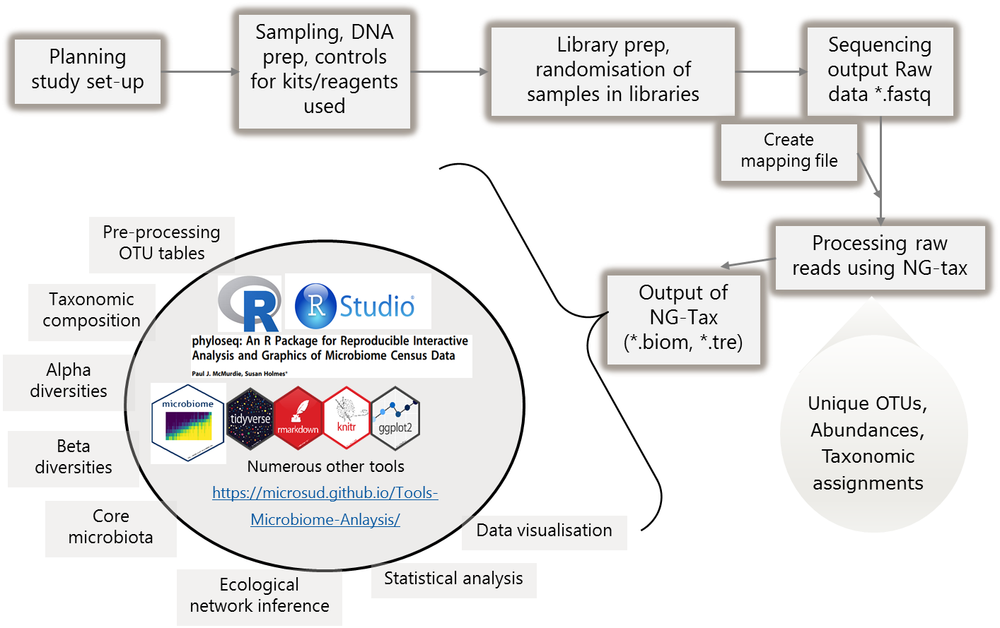

# Session 1

Set-up and pre-processing (9.30-11.30  / 2 hours)

**Standard bioinformatics workflow in microbiome research**

 * Introduction and learning goals
 
 * Alternative study designs
 
 * Overview of a standard bioinformatics workflow
 
 * Reproducible research and best practices in microbiome data science


This tutorial will introduce you to basic steps of microbial community analysis. More importantly on how to look at your data and filter appropriately. We will use the [Human microbiome project phase I data](https://www.ncbi.nlm.nih.gov/pubmed/22699609).  

## OTU or ASVs or sOTUs  
For past few years (maybe decade), identifying Operational taxonomic units (OTUs) from raw sequences used clustering approach. Using 97% identity cut-off was a standard approach and often closed reference OTU picking was accepted in the sicentific community. During the time of the development of tools and bioinformatics approaches this was possibly the best available method. However, as with many other fields of science, the knowledge has been updated. Evolution of bioinformatics approaches is a constant process. Based on current knowledge, the cons of 97% OTU picking stratergy (using clustering approaches) have out-weighed the pros (eg. less time).  

Recent approaches are now focused towards Amplicon Seuence Variants/sOTUs:  
* [Oligotyping](https://www.ncbi.nlm.nih.gov/pmc/articles/PMC3864673/)  
* [Deblur](http://dx.doi.org/10.1128/mSystems.00191-16)  
* [DADA2](https://www.nature.com/articles/nmeth.3869)  
* [NG-Tax](https://f1000research.com/articles/5-1791/v1)  

All above approaches have one common theme, they avoid 97% clustering and focus on minor differences (in many cases single nucleotide variations) to identify unique ASVs/sOTU.   

Note: Some how naming is different and variable. For this purpose and in this book, I will stick to ASVs when data from NG-tax is used.  

In this, section, we will compare outputs from 97% OTU picking approach and NG-tax approach.  
The data used here is the 16S rRNA gene variable region (V1-V3) for 97% OTU-pciking. The raw reads were processed using QIIME 1.9.1, SortMeRNA, and OTU picking was done using the closed-reference OTU-picking at 97% identity.   

For NG-Tax, we use the same raw data and processed through default settings.  

Here, we do not aim to bench mark. For this course, we aim to show differences between results from two approaches.  

For down stream analysis of *.biom files we use [Phyloseq](https://joey711.github.io/phyloseq/) and [microbiome](http://microbiome.github.io/microbiome/).    
Kindly cite all the packages and tools that were used in your analysis as listed at the end of each document in `sessionInfo`. Also make sure that you provide the workflow and scripts you used for analysis atleast as supplementary material with your research article.    
Check [Quick-R](http://www.statmethods.net/).  

## General overview  

<center></center> 

## Structure    

Let us create few folders to organize the analysis. While this can be personal preference, make sure you write the structure to guide others who do not know your data well.  

```{r, eval=FALSE}

# Create Folders as following
# Tables
dir.create("tables")

# Figures
dir.create("figures")

# Phyloseq objects
dir.create("phyobjects")

# Custom codes/notes
dir.create("codes_notes")
```

**Load packages**  

```{r, warning=FALSE, message=FALSE}

library(microbiome) # data analysis and visualisation
library(phyloseq) # also the basis of data object. Data analysis and visualisation
library(microbiomeutilities) # some utility tools
library(RColorBrewer) # nice color options
library(ggpubr) # publication quality figures, based on ggplot2
library(DT) # interactive tables in html and markdown
library(data.table) # alternative to data.frame
library(dplyr) # data handling

```

## Making a phyloseq object  

This is the basis for the analyses demonstrated in this tutorial. In the phyloseq object, information on OTU abundances, taxonomy of OTUs, the phylogenetic tree and metadata is stored. A single object with all this information provides a convinient way of handling, manipulating and visualizing data.  
For more infromation: [phyloseq](http://joey711.github.io/phyloseq/import-data)  

Please remember that the metadata (i.e. mapping) file has to be in *.csv* format (columns have sample attributes). The `read_phylseq` function from microbiome package requires metadata in *.csv* format.  

**Things to be done in QIIME terminal (if required):**  
**Important Note 2**: If you have error in loading the biom files stating **JSON or HDF5** then you need to convert it in to a JSON format.  

For this, use the following command within the QIIME terminal and not in R!  

````{r}

# biom convert -i NGTaxMerged.biom -o ngtax_json.biom --table-type "OTU table" --to-json    

```

For more information on the biom format please  [click here](http://biom-format.org/documentation/biom_conversion.html). 

**Important Note 3**: The most recent version of NG-Tax does not have this issue. 

**NOTE**     
The `read_phyloseq` function can be used for reading other outputs (like .shared and consensus taxonomy files from mothur) into phyloseq object. type `?read_phyloseq` in the console pane for more information.      
If you don't have your own biom file, we have a test dataset stored in `input_data`. Unzip the humanmicrobiome.zip and you will have the original biom file, copy it in the `input_data` folder.  


